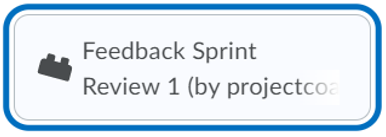
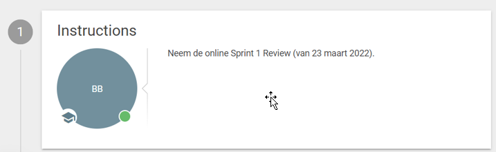
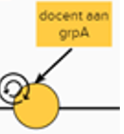
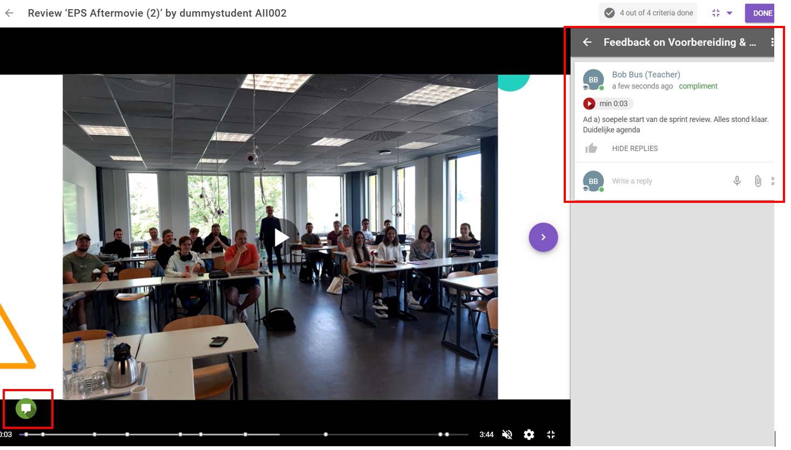
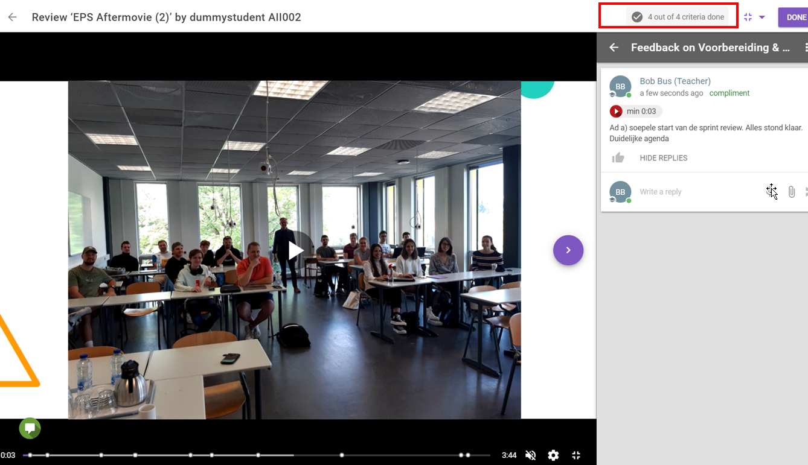
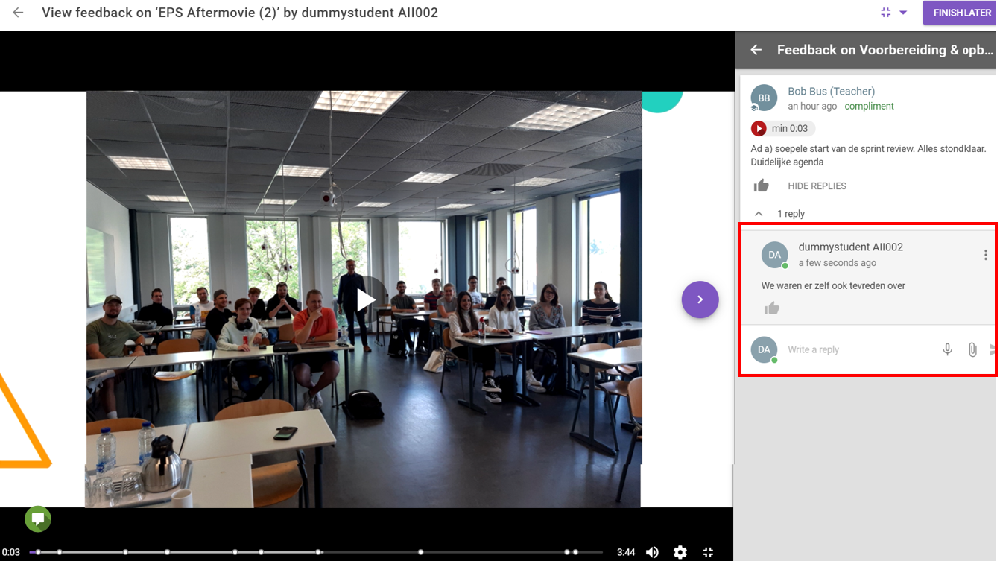
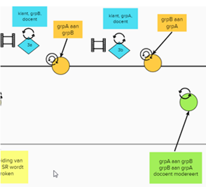
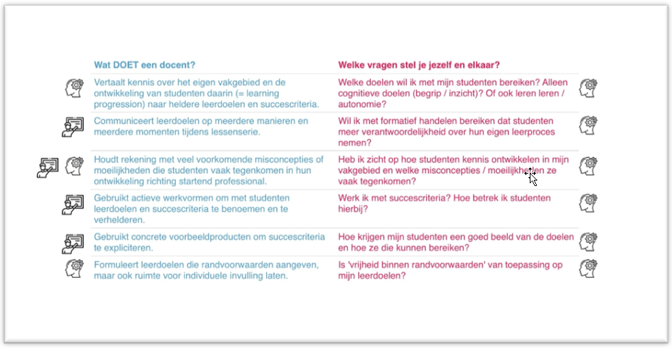
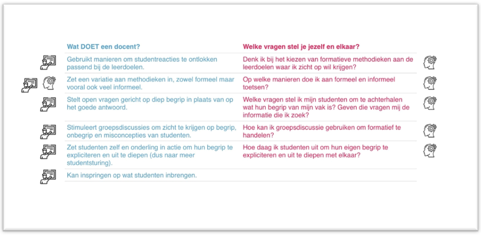
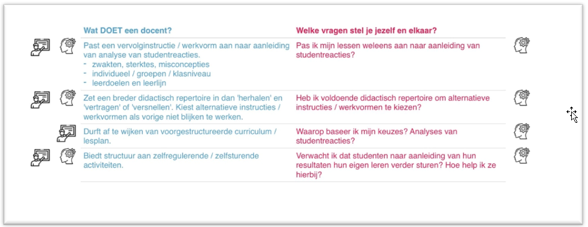

:toc: left
:toc-title: Inhoud
:toclevels: 4
:sectnums:
:sectnumlevels: 4

:imagesdir: ./

:pdf-page-size: A4

= Portfolio Bob Bus/Rob Willemsen, BDB-C, 21/22

_Gecreërd met https://asciidoctor.org/[AsciiDoctor,window=_blank]; gehost op https://github.io/[window=_blank] via https://github.com/[window=_blank]_

== Persoonlijk(e) leerdoel(en)

=== Leeruitkomst
De docent ontwerpt onderbouwd volgens een ontwerpmethodiek een (deel van een) reeks samenhangende leeractiviteiten binnen een vak, thema of leerlijn, en voert deze (deels) uit zodanig dat voor de student een optimale leersituatie/blend ontstaat.

=== Leerdoel(en)
[blue]#[Bob] +
Ik wil de student actiever betrekken in het proces van formatieve feedback geven en ontvangen zodat de feedback effectiever is voor het leerproces van de student.#

[blue]#Subleerdoelen:#

* [blue]#Ik wil in mijn projectlessen gebruik gaan maken van beeldopnames bij het geven van feedback, zodat deze beter beklijft en dit dus het leerproces bevordert.#
* [blue]#Ik wil in mijn projectlessen de studenten feedback laten geven op hun eigen handelen, aan de hand van beeldopnames, zodat de student actiever betrokken is bij het leerproces en dit dus het leerproces bevordert.#
* [blue]#Ik wil in mijn projectlessen de studenten feedback laten geven op hun het handelen van hun collega-studenten, aan de hand van beeldopnames, zodat de student actiever betrokken is bij het leerproces en dit dus het leerproces bevordert.#

[lime]#[Rob]#

* [lime]#(Leerdoel op mezelf gericht:) Ik pas effectieve manieren toe om formatieve feedback in te zetten zodanig dat het leerresultaat van de studenten vergroot wordt.#
* [lime]#(Leerdoel op implementatie/studenten gericht: ) Ik onderzoek de bouwstenen voor effectieve didactiek (12 stuks), zodanig dat ik een gefundeerde keuze kan maken welke ik als projectdocent ga inzetten om studenten als projectgroep een goed resultaat te laten behalen.#

== Ontwerp
=== Vraagstuk
De student is in staat om op een professionele wijze de scrum/agile methodiek toe te passen in een project.

=== Student en context, analyse
==== Doelgroep
image::mindmap_doelgroep.png[doelgroep]

De gemiddelde (2e jaars) Informatica-studenten hebben een aantal kenmerken gemeenschappelijk die -volgens bovenstaande rubricering - vooral op sociaal, demografisch, professioneel en studiegebied liggen: het zijn b.v. vrijwel allemaal jonge mannen, uit de ‘regio’ afkomstig, redelijk uni-cultureel, ook privé veel in & met IT bezig (o.a. gamend, communicerend/samenwerkend via online platformen als Discord), niet al te veel spreiding in behaalde ec’s, niet overdreven planmatig maar wel flexibel, enz.

Er is een deelgroep van studenten met een vaak beperkte autistische functiebeperking. Voor hen is flexibiliteit soms wat lastiger, b.v. binnen teamwork, maar het mooie aan de studentenpopulatie is dat de rest van een projectgroep vaak wel weer zo flexibel is om dat op te vangen.y

Als er verschillen zijn tussen de studenten, liggen die vaak op het terrein van de voorkennis en ervaring op web- en agile terrein, incl. ervaring in het werkveld. Het onderscheid tussen havisten en MBO’ers is hier vaak goed zichtbaar.

Het agile projectwerk dat verderop geïntroduceerd wordt, leent zich overigens prima om met de verschillen om te gaan. Wat ervarener studenten kunnen een explicietere rol als scrum master of product owner op zich nemen, en een agile project dwingt studenten ‘by nature’ om planmatig te werken.

==== Leerdoelen
===== Context
In semester 4 gaan de studenten in projectgroepen een applicatie bouwen voor een echte opdrachtgever. De projectmethode die ze hierbij moeten hanteren is agile/scrum. Dit is een veel gebruikte ontwikkelmethodiek in de praktijk, zeker in gevallen waarbij de opdrachtgever nog niet helder heeft welke wensen hij/zij precies heeft.

De opdrachtgever komt i.h.a. uit de buitenwereld en is geen overdreven IT-expert. Hij draagt een casus aan en fungeert ook als klant tijdens het project. 

De studenten moeten leren en laten zien dat ze op een professionele wijze de scrum/agile methodiek kunnen inzetten om tot een werkende applicatie te komen die voldoet aan de wensen van opdrachtgever en van goede kwaliteit is.

Het project loopt een heel semester, en duurt dus ca. 20 weken. Per week besteedt elke student ongeveer 1,5 dag aan het project.

[blue]#[Bob:] Binnen de BI-major wordt hierbij gebruikt van een ‘low code’ tool. Met een dergelijke tool kan, zonder al te veel te moeten programmeren/coderen, een werkende applicatie gebouwd worden.#

[lime]#[Rob:] Binnen de SO-major moeten studenten m.b.v. PHP, Javascript en frameworks voor beide talen een applicatie bouwen.#

===== Afstemming met studenten
Vooralsnog geen afstemming met studenten nodig/gedaan. Het betreft het optimaliseren van een bestaande module. Evaluatie achteraf blijft uiteraard wel gewenst (zie stap 9.2).

=== Taakanalyse
De projectgroep moet (dus) een werkende applicatie voor een echte opdrachtgever maken, gebruik makend van de agile/SCRUM-projectmethodiek. Binnen deze methodiek wordt in sprints van 2-3 weken steeds een nieuwe, werkende versie van de applicatie opgeleverd, waarbij per sprint nieuwe functionaliteit wordt toegevoegd. Deze functionaliteit wordt beschreven d.m.v. zgn. user stories.

Het project duurt 20 weken en bestaat uit 6 sprints van ieder ongeveer 3 weken. De externe opdrachtgever heeft initieel een casus aangedragen, die door de projectgroep vertaald moet worden in user stories. Per sprint wordt steeds een aantal user stories gebouwd en getest, en daardoor heeft de klant/opdrachtgever aan het einde van de 20 weken een werkende applicatie met daarin de (belangrijkste) functionaliteiten die in dat tijdsbestek van 20 weken gebouwd konden worden.

==== Taken
De SCRUM-methodiek onderscheidt de volgende activiteiten en deliverables:

* Product backlog en sprint backlog’s
* Definition of done
* Daily stand-ups
* Sprint planning
* Sprint review
* Sprint retrospective
* Product backlog refinement

Voor al deze activiteiten en deliverables worden binnen het project leerdoelen geformuleerd, maar wij zullen verder enkel inzoomen op de Sprint Review: daar ligt ons verbeterplan voor de komende editie van dit project.
De sprint reviews zijn belangrijke ‘ontmoetingsmomenten’ met extern betrokkenen (de klant/opdrachtgever) waar potentieel veel van te leren valt.

==== Leerdoel m.b.t. de sprint review
* *Gedrag*: De projectgroep/het SCRUM-team presenteert het gerealiseerde werk aan de product owner/externe opdrachtgever, zodanig dat het voor deze volstrekt duidelijk is wat wel en niet gerealiseerd is in de afgelopen sprint en zodanig dat er overeenstemming is tussen de projectgroep en de externe opdrachtgever wat er op de sprintplanning staat voor aankomende sprint.
* *Beroepscontext*: Project waarbij voor een externe opdrachtgever een werkende applicatie gebouwd wordt volgens de SCRUM-methodiek.
* *Resultaat*: Voor de externe opdrachtgever is duidelijk wat gerealiseerd is in de afgelopen sprint en wat er gerealiseerd gaat worden in de aankomende sprint

==== Ambitie 2025
Meegenomen kenmerken uit de ambitie:

* ‘samenleving werkt (steeds meer) vraaggestuurd ipv aanbodgestuurd’ <= probleem van opdrachtgever is de centrale vraag
* 'multidisciplinariteit’ (=: MD) => er zijn meerdere rollen binnen het scrum-proces (scrum master,  product owner, ontwikkelteam) waardoor in meer of mindere mate sprake is van MD; dat de rol van product owner (deels) van buiten komt, is het duidelijkste MD-voorbeeld binnen dit onderwijs
* ‘studenten werken in een kleinschalige omgeving waar we elkaar zien’
* ‘ontwikkelen van wendbaarheid en veerkracht’ => (leren) werken op agile manier => ‘creëert’ wendbare en veerkrachtige professionals (mits op juiste manier gedaan)
* ‘co-creatie met werkveld’: opdrachtgever komt direct uit de maatschappij of het werkveld
* ‘belang van samenwerken’ => project op agile-manier!!
* ’duurzame oplossingen’ => wel als die aan de behoefte van de opdrachtgever voldoet!

===== Onderwijsvisie
(PS: Alleen vernoemd wat nog toevoegt aan hetgeen onder ambitie al vernoemd is)

* ‘studenten leren o.a. een onderzoekende, ondernemende en verantwoordelijke houding’:
** het projectteam (lees: de studenten) moet nieuwsgierigheid naar de context en het probleem van de opdrachtgever aan de dag leggen om samen met hem te kunnen zoeken naar een juiste oplossing
** binnen het agile proces moet het projectteam (lees: de studenten) actief met een voorstel komen wat in de komende sprint opgepakt wordt en waarom en dit afstemmen met de opdrachtgever; dit vraagt (om) een kritische en ondernemende houding (aan te leren)
** per sprint gaat het projectteam (lees: de studenten) realisatie-verplichtingen aan die ze aan het einde moet laten zien; ze leren daarvoor gezamenlijk en individueel verantwoordelijkheid te nemen
** afhankelijk van de vraag van de opdrachtgever kunnen ook SDG/duurzame aspecten aan bod komen binnen het project
* ‘Zelfregulerend leren’: via daily standups zijn studenten continu bezig met leren sturen en monitoren van de eigen activiteiten, en daarbij komt actief de vraag ‘Waar heb ik hulp bij nodig / wat hindert mijn voortgang?’ aan bod.
* ‘Motivatie speelt een belangrijke rol bij het verwerven van nieuwe kennis en vaardigheden’:
** via daily standups is het zeer frequent mogelijk om te ervaren dat wat gisteren voorgenomen werd vandaag ook gelukt blijkt te zijn =?>dit versterkt het gevoel van competentie
** bij sprint planning in een agile omgeving is het van groot belang om kleine, behapbare taken te formuleren; dat bevordert de haalbaarheid en dus ook het gevoel van competentie, van dingen voor elkaar krijgen
* ‘Docenten hebben een sterke binding met het huidige werkveld’: doordat docenten ook aanwezig zijn bij de bijeenkomsten met de opdrachtgever, draagt dit bij aan hun binding met het werkveld
* ‘Hoe effectieve, ontwikkelgerichte feedback te geven, o.a. via leergemeenschappen voor studenten’ is onderdeel van de onderwijsvisie, en juist ook onderwerp van onze vraag.
* ‘Daadwerkelijk – dus niet alleen online – bij elkaar komen is cruciaal voor motivatie, welzijn en leren van studenten’ => daarom worden sprint reviews zoveel mogelijk fysiek gedaan
* ‘Gebruik maken van de bouwstenen voor effectief leren’: is expliciet in onze leerdoelen opgenomen.
* ‘Betekenisvol leren: houding … door studenten aan te moedigen kritisch te reflecteren op hun eigen handelen … ‘ => gaan we in ons voorstel meenemen

===== Onderwijsmodel
* ‘Vaardigheden integreren we in de beroepsprestaties en studenten leren ze aan in de beroepscontext’ => daily standups en sprint reviews zijn concrete beroepsacties; binnen die context leren ze dus; bovendien worden binnen deze acties zeker ook de algemene beroepsvaardigheden als communicatie, planning enz ontwikkeld
* ‘Backwards design’:
** zo is ook deze BDB-module ingericht ;-)
** ‘vaststellen van de beoogde doelen op basis van de benoemde beroepsbekwaamheid’ en ‘beroepsbekwaamheid wordt aangetoond dmv beroepsprestaties’ => daar mag agile werken uiteraard niet in ontbreken
* De beschreven flexibilering van de opleiding (25% vrij kiezen, vaste module-omvang, enz) valt buiten de scope van onze keuze om binnen een bestaande module te werken en dat binnen een toepassing die binnen 1.5 periode valt.

===== Blended learning
Definitie die Avans hanteert mbt Blended Learning = een rijke leerervaring als resultaat van een weloverwogen, geïntegreerde en harmonieuze combinatie van synchrone en asynchrone leeractiviteiten waaraan studenten op afstand, op school en op de werkplek deelnemen (perspectief van de student). Elke fase in het leerproces wordt uit vier componenten opgebouwd, vier knoppen waaraan kan worden gedraaid: de sociale context (bv in duo’s), de strategie (bv instructie), het communicatiekanaal (bv op school, of via BrightSpace) en de modus (synchroon of asynchroon). Door deze componenten te mixen ontstaat de blend. Er is geen vaste succesvolle receptuur: blended onderwijs is geen re-cept maar een con-cept. Verderop in het ontwerpproces zal duidelijk worden dat deze principes toegepast worden. 
 
===== Gap-analyse
Wij willen de focus leggen op het overbruggen van de didactische gap, met als doel de inhoudelijke gap (het professioneel kunnen toepassen van SCRUM in de praktijk) te overbruggen. Het project is nl met name bedoeld om te toetsen in hoeverre de studenten de kennis met betrekking tot het SCRUM-proces (die wordt opgedaan in de SWEN4-lessen) kunnen toepassen in een  praktijksituatie. 

===== Didactische gap
*Huidige situatie*: Docent heeft momenteel een prominente rol bij het geven van feedback (is nu veelal zenden). Dit gebeurt op basis van een feedbackformulier waarin feedback/beoordelingscriteria benoemd zijn. De docent geeft na iedere sprint review via het invullen van dit formulier feedback aan de projectgroep. +
Deze vorm was al aan de orde op het moment dat wij als projectdocenten in het project ‘stapten’, en is uiteraard gebaseerd op de veronderstelling dat docenten weten ‘hoe het moet’ een daarom dus nuttige feedback kunnen geven.  Bovendien is die vorm makkelijk uitvoerbaar, b.v. in situaties waarin de sprint review sessies fysieke sessies waren, d.w.z. met aanwezigheid van zowel opdrachtgever als studenten. 

*Gewenste situatie*: Studenten een actievere rol geven in het feedbackproces. +
Mede door de snelle, technische ontwikkelingen én gedwongen door Corona-omstandigheden zijn online vormen van zowel sprint review sessies als feedback geven binnen bereik en binnen ervaring gekomen.

*Knelpunt*: Huidige manier van feedback is weinig efficiënt. Kost veel energie van de docent en zet de student niet aan tot zelf nadenken. Feedback wordt gezien als een afvinklijstje voor het volgende toetsmoment.

*Verbeteractie*: Studenten worden aangezet/’gedwongen’ tot een actievere rol in het feedbackproces:

* Studenten geven feedback op hun eigen sprint reviews.
* Studenten geven feedback op sprint reviews van andere projectgroepen.

=== Leeruitkomst en leerdoelen
==== Leeruitkomst
De projectgroep is in staat om op een professionele wijze een sprint review uit te voeren binnen een SCRUM-project.

==== Leerdoelen m.b.t. de sprint review
NB: De beroepscontext is steeds de sprint review sessie.

*Gedrag*: De projectgroep demonstreert de gerealiseerde user stories aan de opdrachtgever, waarbij de opdrachtgever expliciet aangeeft welke user stories wel en niet geaccepteerd worden. +
*Resultaat*: Voor alle user stories uit de sprint planning is helder welke afgerond én geaccpeteerd zijn, en welke nog aanvullend werk behoeven en wat dat aanvullende werk is.

*Gedrag*: De projectgroep demonstreert aan de opdrachtgever welke user stories niet gerealiseerd zijn en waarom niet, en stemt met de opdrachtgever af hoe met deze user stories verder verwerkt worden. +
*Resultaat*: Voor alle user stories uit de sprint planning is helder welke niet afgerond zijn, en welke aanvullende werkzaamheden hiervoor benodigd zijn.

*Gedrag*: De projectgroep maakt afspraken met de opdrachtgever welke user stories gerealiseerd zullen worden in de volgende sprint. +
*Resultaat*: Voor de externe opdrachtgever is duidelijk wat de sprint planning van de aankomende sprint is.

*Gedrag*: De sprint review sessie verloopt efficient en effectief. +
*Resultaat*: De voorbereiding is dusdanig dat de sessie meteen van start kan, de agenda is helder voor iedereen, de klant wordt actief betrokken bij het verloop van de sessie, en de communicatie/interactie met de opdrachtgever verloopt professioneel.

=== Ordening
==== Constructive alignment
Aansluiting Leerdoelen (zie boven) – Toets (feitelijke uitvoering Sprint Review zelf) – Onderwijsactiviteiten (lesactiviteiten waarin feedback gegeven wordt op Sprint Review: tops & tips)

===== Backward Design
Het basismodel van Backward Design bestaat uit drie fasen:

1. *Leeruitkomsten* => zie boven
a. Duurzame kennis: zie SWEN4-lessen mbt sprint reviews
2.	*Toetsing* dat leeruitkomsten behaald worden
a.	Uitvoeren van een sprint review voor een externe opdrachtgever conform de beoordelingscrietrai, incl. formuleren van (inhoudelijk!) correct feedback daarop
3.	*Leeractiviteiten*
a. Te bereiken kennis/vaardigheden/procedures: zie taakanalyse
b.	Lesmateriaal: zie SWEN4-lessen & beoordelingstabel (verderop)
c.	Leer- en onderwijsactiviteiten: voorbereiden, uitvoeren en evalueren van sprint reviews, incl. formuleren en bespreen van feedback

===== Blended learning
In de onderstaande tijdslijn is sprake van een 3-traps ‘raket':

* In de 1e cyclus verzorgt de docent de feedback
* In de 2e cyclus geeft de projectgroep zichzelf feedback
* In de 3e cyclus geven 2 projectgroepen met dezelfde opdracht(gever) elkaar feedback.

Iedere cyclus verloopt volgens hetzelfde stramien:

* Tijdens een projectbegeleidinsgles wordt de voorbereiding van de sprint review besproken (F2F, sync)
* De projectgroep bereidt voert zelfstandig de voorbereiding op de sprint review uit (F2F of online, async)
* De sprint review vindt plaats (online, sync, wordt opgenomen)
* De feedbackgever formuleert de feedback aan de hand van criteria in een beoordelingsformulier en via markering in de opname (F2F of online, async)
* De feedbackgever bespreekt de feedback met de projectgroep (F2F, sync)

image::mural_timeline.png[tijdslijn]

(MURAL: https://app.mural.co/t/bobreinrob5594/m/bobreinrob5594/1639687123087/58f366da60042c18ce222e56423d43103dc31e73?sender=u7d4fa23e3c01b78b6e9d7027[window=_blank])

=== Instructiestrategieën
[blue]#[*BI-project:*]#

[blue]#Nu al aandacht voor:#

* [blue]#*2: Geef duidelijke gestructureerde instructie*. De criteria-lijst/rubric waaraan een goede SR moet voldoen, wordt doorgenomen met de studenten in de projectlessen voorafgaand aan de eerste SR.#
* [blue]#11: *Geef feedback die leerlingen aan het werk zet*. De eerstvolgende projectles volgend op de SR, wordt feedback gegeven aan de studenten mbt betreffende SR. Per onderdeel van een SR wordt teruggekoppeld/toegelicht door de projectdocent in welke mate ze dit onderdeel al beheersen (O/V/G/ZG).#

[blue]#Meer aandacht voor:#

* [blue]#*4 Gebruik woord en beeld*: momenteel wordt alleen in woord feedback gegeven op een SR. In het nieuwe ontwerp zal de projectdocent ook gebruik gaan maken van een opname van de SR zodat de woordelijke feedback toegelicht/ondersteund kan worden ahv de beelden.#
* [blue]#*5 Laat leerstof actief verwerken*: Studenten gaan nu ook hun eigen SR beoordelen (aan hand van rubric, incl feedback & voorbeelden) en ook die van een andere groep. Zie ook 11.#
* [blue]#*9 Afwisselende oefentypes*: momenteel is de wijze van feedback geven voor elke SR hetzelfde. In  de nieuwe situatie is de manier van feedback geven per SR anders: de feedback op de eerste SR wordt door de projectdocent gedaan. De feedback op de tweede SR wordt door het eigen projectgroepje gedaan. De feedback op de derde SR wordt door een ander projectgroepje gedaan (peer reviews).#
* [blue]#*11 Feedback geven*: Geef feedback die studenten aanzet tot ‘detective’ werk. Momenteel wordt dat niet gedaan. Feedback wordt gezien als een afvinklijstje voor de volgende SR. In de nieuwe situatie moet de student bij de tweede en derde SR zelf op zoek (‘detectie’) naar de feedback.#

[lime]#[*SO-project:*]#

[lime]#Nu al aandacht voor:#

* [lime]#*1: Activeer relevante voorkennis*:#
** [lime]#Bij sprint 0 worden studenten (actief) gewezen op SWEN4-slides, met name die van week 2,#
** [lime]#Bij volgende sprints wordt met name verloop van vorige SR in herinnering gebracht: wat ging er goed (houden zo) en wat kan er beter (aanpakken).#
* [lime]#*2: Geef duidelijke gestructureerde instructie*:#
** [lime]#De rubric die gehanteerd wordt voor de beoordeling van de SR wordt gedeeld. Daarmee zijn de doelen duidelijk.#
** [lime]#Bij iedere behalve de eerste SR wordt expliciet met studenten besproken wat de verbeterpunten zijn voor de komende SR, en hoe men die denkt te bereiken.#
* [lime]#*10: Gebruik toetsing als leer- en oefenstrategie*:#
** [lime]#De beoordeling van SR’s telt mee, studenten stoppen er actief tijd & moeite in om goed te presteren.#
** [lime]#Bij iedere behalve de eerste SR wordt expliciet met studenten besproken wat de verbeterpunten zijn voor de volgende keer: ze moeten boven water halen hoe het de vorige keer ook weer ging, soms op basis van een opname van de SR (door Corona waren die gedwongen online en werden ze opgenomen, dus waren ze terug te kijken bij de bespreking).#
* [lime]#*11: Geef feedback die leerlingen aan het werk zet*:#
** [lime]#Na iedere SR wordt op basis van de rubric aangegeven wat goed ging maar zeker ook wat beter kan.moet. Dit gebeurt op basis van concrete voorbeelden, die soms aan de hand van de SR-opnames duidelijk aan te wijzen waren.#

[lime]#Meer aandacht voor:#

* [lime]#*4. Gebruik woord en beeld*:#
** [lime]#Er wordt nu expliciet, en niet meer toevallig door omstandigheden gedwongen, ingezet op woord (feedback in rubric-vorm) én beeld (beeldopname en daarin pinpointen wat top/tip is).#
* [lime]#*5: Laat leerstof actief verwerken*:#
** [lime]#Studenten gaan nu ook hun eigen SR’s beoordelen (aan hand van rubric, incl feedback & voorbeelden) en ook die van een andere rgoep (idem).#
* [lime]#*9: Afwisseling in oefentypes*:#
** [lime]#We gaan 3 verschillende vormen van beoordeling/feedback toepassen: 1. docent is actor, 2. groep is actor naar zichzelf, 3. groep is actor naar andere groep.#

=== De boodschap ontwerpen
==== Opzet
In de huidige module-opzet gaan steeds 2 projectgroepen aan de slag voor dezelfde opdrachtgever. Zij werken echter compleet separaat, dus ieder aan hun eigen oplossing voor de opdrachtgever, die dus aan het einde uit 2 oplossingen kan kiezen en gaandeweg ook door 2 groepen op nieuwe ideeën gebracht kan worden.

In de nieuwe opzet wordt eigen rol van de student(en) groter en actiever door verschillende manieren te hanteren om eigen en andersmans prestaties te ‘beoordelen’. Dit gaan we doen:

* door sprint-reviews te laten opnemen
* 1e ronde: docent geeft op basis van beoordelingsformulier en opnames (en evt. live bijwonen) feedback
* 2e ronde: studenten geven zichzelf (werkend met zelfde beoordelingsformulier als docent in 1e ronde?) feedback, op basis van opnames en live bijwonen
* 3e ronde: studenten geven andere groep binnen hetzelfde project (werkend met zelfde beoordelingsformulier als docent in 1e ronde?) feedback op basis van hun opnames, en benoemen ook wat andere groep beter doet (en hoe zij dat zelf gaan toepassen) en wat andere groep kan verbeteren (en geven advies hoe zij dat zouden kunnen doen)
* docenten ‘beoordelen’ bij ronde 2 en 3 de feedback van de groep (feedback op de feedback)

=== Ontwikkeling vh materiaal
We gaan de volgende  ICT-middelen inzetten: MS-Teams, FeedbackFruits (FBF), BrightSpace.

Toelichting:

* *MS-Teams* voor de Sprint Reviews met de opdrachtgever. Deze Sprint Reviews worden opgenomen ten behoeve van de feedbacksessies
* *FeedBackFruits* (FBF) geïntegreerd in *BrightSpace*. FBF heeft de functionaliteit om markeerpunten en feedbackcomments (suggestions & compliments) in een MP4-bestand te plaatsen. Bovendien heeft FBF de mogelijkheid om expliciet feedback te geven aan de hand van vooraf gedefinieerde beoordelingscriteria. FBF kan zo ingericht worden dat de feedback gegeven moet worden door de projectdocent, door de eigen projectgroep, of door een andere projectgroep. 

==== Implementatie
In de schermen hieronder worden de implementatiestappen toegelicht. Deze worden steeds gekoppeld aan onderdelen uit de tijdslijn, zoals die in paragraaf 2.5 beschreven is. +
Noot: een deel van onderstaande screenshots komt uit de BrightSpace ‘zandbak’-omgeving, omdat de feitelijke Sprint Reviews (=: SR's) nog niet plaatsgevonden hebben op het moment dat dit portfolio geschreven is. De ‘echte’ BrightSpace courses zijn al ewl volledig geconfigureerd op de manier zoals hierna beschreven (zie URL’s hieronder).

[blue]#[*BI-project*:] Link naar BrightSpace-course: https://brightspace.avans.nl/d2l/le/lessons/32362/units/450331[AII Project Low code - Blok 7 (BI) 2021-22 P3,window=_blank].#

[lime]#[*SO-project*:] Link naar BrightSpace-course: https://brightspace.avans.nl/d2l/le/lessons/36632/units/468400[AII Project Agile-Blok 7/8 (SO) 2021-22 S2,window=_blank].#

===== Sprint Review 1
image::implementatie_01.png[]

SR1 (45 minuten) vindt online plaats en wordt opgenomen via een Teams-sessie. Opdrachtgever, projectgroep en projectdocent zijn hierbij aanwezig.

image::implementatie_02.png[]

De opname (MP4-bestand) wordt na afloop door de studenten in BrightSpace gepost.

image::implementatie_03.png[]

image::implementatie_06.png[]

De docent geeft feedback op SR1 met behulp van FeedBackFruits (FBF).

image::implementatie_08.png[]

In onderstaand scherm geeft de projectdocent feedback per beoordelingscriterium. De feedback verloopt via vrij in te voeren tekst en de als beoordelaar geef je aan of het een *compliment* (top) of *suggestion* (tip) betreft. Je ziet ook exact op welk tijdstip in de SR-opname de feedback betrekking heeft. De tekst wordt zichtbaar als je op het groene ballonnetje klikt (zie rode kaders).

Je kunt FBF zo inrichten dat bij elk beoordelingscriterium tenminste 1 feedback-opmerking moet worden ingevoerd. Je kunt de feedback-sessie dus pas afronden als alle beoordelingscriteria aan bod zijn gekomen (zie rood kader).

Bij het geven van feedback zijn alle beoordelingscritera zichtbaar voor de beoordelaar (zie rood kader).

image::implementatie_11.png[]

Per beoordelingscriterium is een toelichting zichtbaar (zie rood kader).

image::implementatie_12.png[]

Nadat de beoordelaar (in SR1 nog de docent) de feedback-opmerkingen ingevoerd heeft, krijgen de studenten een bericht en kunnen ze de feedback bekijken.

image::implementatie_13.png[]

De studenten kunnen de feedback bekijken en daar evt. zelf ook weer reacties op geven die zichtbaar zijn voor de beoordelaar (zie rood kader).

Je kunt ook zien of alle feedback gelezen is door de studenten (zie rood kader).

image::implementatie_15.png[]

De docent zal tijdens de projectbegeleidingsles de sprint review nogmaals doorlopen samen met de groep, en zal  ook expliciet stilstaan bij de reacties van de studenten op de gegeven feedback.

image::implementatie_16.png[]

===== Sprint Review 2

In SR2 geven de studenten feedback op hun eigen sprint review. Het te doorlopen proces is verder hetzelfde als bij SR1 beschreven. 

image::implementatie_17.png[]

===== Sprint Review 3

Voor SR3 geven de studenten feedback op de sprint review van een andere projectgroep (die overigens aan dezelfde opdracht voor dezelfde opdrachtgever werkt). Ook hier is het te doorlopen proces is verder hetzelfde als bij SR1 beschreven.

===== Inrichten van Brightspace & FBF

Om bovenstaande review-sessies goed te laten verlopen moet FBF in Brightspace uiteraard goed ingericht worden. +
Voor SR1 kies je voor ‘FBF Assignment Review’. Voor SR2 en SR3 kies je voor ‘FBF Peer Review’ (zie rode kaders).

image::implementatie_19.png[]

Voor elke SR moet bij de configuratie van FBF aangegeven worden dat het 1 review betreft voor de gehele projectgroep (en dus niet per student). +
Voor SR2 en SR3 moet expliciet aangegeven worden dat de feedback door de gehele groep kan worden gegeven en niet per se per student (zie rode kaders).

image::implementatie_20.png[]

Daarnaast moet voor SR2 expliciet aangeven worden dat de feedback door de projectgroep zelf gegeven wordt (en dus niet door een andere projectgroep). +
Bij SR3 moet onderstaande checkbox dus uit blijven staan.

image::implementatie_21.png[]

== Evaluatie
=== Evaluatie onderwijsleerdoelen
Er zijn 3 momenten & vormen van feedback:

* Projectdocent geeft studenten feedback
* Studenten geven zichzelf feedback
* Studenten geven elkaar feedback

Onderstaande tabel wordt als model gebruikt voor de formatieve beoordeling van het verloop van de Sprint Review:

[cols="1,15"]
|===
|1 
|Voorbereiding & opbouw sprintreview: +
a) De sprintreview kan direct van start +
b) De rolverdeling is duidelijk bij aanvang van de meeting en wisselt per sprintreview +
c) Er is een agenda die duidelijk wordt toegelicht aan de klant
|2
|Getoonde functionaliteit:  +
a) Alle afgeronde user stories van de sprint backlog worden gedemonstreerd +
b) Voor alle niet afgeronde user stories van de sprintbacklog wordt een goede verklaring gegeven +
c) Alle gedemonstreerde user stories werken correct  en voldoen aan de kwaliteitseisen zoals beschreven in de DoD +
d) De opdrachtgever wordt in de gelegenheid gesteld de getoonde user stories al dan niet te accepteren +
|3
|Verzamelen feedback: +
a) De klant wordt actief bij de presentatie betrokken +
b) De studenten gaan op professionele wijze om met alle aanwezigen +
c) Opmerkingen / feedback worden genoteerd. 
|4
|Afsluiting sprintreview: +
a) Het verloop van de afgelopen sprint wordt geëvalueerd (middels velocity en sprint burn-down) +
b) Een voorstel voor de komende sprint wordt toegelicht aan de klant +
c) De klant wordt om feedback gevraagd m.b.t. de getoonde planning 
|=== 

==== Formatief handelen
M.b.t formatief handelen gaan we uit van de cyclus die Gulikers en Baartman ontworpen, zoals hieronder weergegeven. +
Per fase zoomen we met name in op de vragen die onder ‘Wat DOET een docent?’ worden genoemd.
(Hieronder wordt de afkorting SR gebruikt: dit staat voor Sprint Review).

image::gulikers_baartman_cyclus.png[cyclus Gulikers Bartman]

===== Fase 1: Verwachtingen verhelderen
In deze fase draait het om het opstellen van leerdoelen en deze communiceren naar de studenten.

De rubric/het beoordelingsformuler zal (steeds) de leidraad zijn om de SR-leerdoelen toe te lichten (1e punt). +
Aan het begin van het project worden (uiteraard) de SR-leerdoelen geintroduceerd en toegelicht. Gaanderweg het project is er steeds meer sprake van heractiveren van de leerdoelen (2e punt), doordat ze bij iedere SR de basis van de feedback vormen. +
Door de genoemde ‘3-traps raket’ krijgen de studenten een steeds actievere rol krijgen (4e punt).
Doordat docent en studenten momenten in de opnames moeten markeren waarop hun feedback (tops en tips) betrekking heeft, worden ze gedwongen om specifieke voorbeelden te geven bij het formuleren van de feedback (5e punt).

===== Fase 2: Studentreacties ontlokken en verzamelen
In deze fase draait het om de manieren, methoden en strategieën die je inzet om erachter te komen of de studenten de tot dan toe onderwezen leerstof begrijpen beheersen.

De studenten moeten zichzelf en een andere groep feedback geven/’beoordelen’ op basis van de rubric, en zullen dus reacties moeten geven (1e punt). Daarover gaan ze, zeker bij het elkaar feedback geven, met elkaar in gesprek en discussie (4e & 5e punt).

===== Fase 3: Reacties analyseren en interpreteren.
In deze fase draait het om het analyseren en interpreteren van de studentreacties, zodat je daarna kunt bepalen welke vervolgstappen nodig zijn om de leerdoelen te behalen.

image::gulikers_baartman_fase3.png[fase 3 uit cyclus Gulikers Bartman]

Bij de 1e SR beoordeelt docent op een manier die ook meteen als voorbeeld kan & moet dienen hoe studenten dat later naar de eigen en de andere groep moeten doen (1e punt). +
De gehanteerde rubric is vooral inhoudelijk (2e punt) – al speelt vorm er wel een rol bij, b.v. via de manier waarop studenten met opdrachtgever omgaan/communiceren. +
Het 5e punt wordt gerealiseerd door de actieve inbreng van studenten vanaf de 2e cyclus.

===== Fase 4: Communiceren met studenten over resultaten
In deze fase draait het om het geven van feedback en het terugkoppelen van de resultaten, waarbij het voor de studenten duidelijk wordt waar zij staan ten opzichte van de leerdoelen.

image::gulikers_baartman_fase4.png[fase 4 uit cyclus Gulikers Bartman]

Feedback gebeurt aan hand van rubric die rechtstreeks aan SR-leerdoelen gekoppeld is (1e punt). +
Door te pinpointen op welke concrete momenten in SR (via opname) tops & tips betrekking hebben, wordt feedback concreet gemaakt (2e punt). +
Studenten benoemen (dus) ook zelf verbeterpunten die ze bij volgende SR gaan toepassen (3e punt).
En 4e punt is al diverse keren benoemd ;-).

===== Fase 5: Vervolgacties ondernemen: onderwijs & leren aanpassen
In deze fase draait het om het ondernemen van concrete acties. Als docent voor het aanpassen van de les, als student voor het aanpassen van het leergedrag. Altijd op basis van de eerdere stappen.

Het didactische repertoire is door ons wel op voorhand benoemd, maar we voorzien niet standaard in alternatieven (2e punt). Wel wordt aan het einde van de ‘3-traps raket’ geëvalueerd met de hoe de aanpassingen t.o.v. de oude situatie en de nu gehanteerde 3 cycli ervaren zijn, en kan o basis daarvan aanpassingen plaatsvinden in de volgende editie van het project. +
In het laatste punt wordt voorzien door steeds dezelfde feedbackcriteria te gebruiken, in 1e instantie geïntroduceerd en toegepast door de docent. Door steeds dezelfde feedbackcriteria te hanteren dient dit als houvast.

image::gulikers_baartman_formatief_summatief.png[formatief naar summatief]

De studenten moeten in de tweede SR laten zien dat ze de feedback van de eerste SR ter harte hebben genomen. De studenten moeten in de derde SR laten zien dat ze de feedback van de tweede SR ter harte hebben genomen (zie bovenstaand plaatje).

=== Evaluatie eigen leerdoelen
Het is o.i. niet mogelijk om een betrouwbare evaluatie te doen op basis van cijfers, slagingspercentages, e.d. Daarvoor is het experiment te klein, is er geen controlegroep, is het aantal veranderende factoren (veel) te groot, enz.

Daarom willen we via een vragenlijst en een bespreking met de studenten achterhalen wat zij vinden van deze inrichting: waar hebben ze het meest van geleerd, waaruit blijkt dat, enz. +
Hierbij hanteren we de volgende vragen:

* Geef per feedbackvorm tops & tips.
* Welke van de 3 feedbackvormen was nuttigst en waarom (wat heb je daar dan expliciet bij opgestoken)?
* Is de volgorde van de 3 vormen logisch?
* Voel je je toegerust om de 2e en 3e feedbackvorm uit te voeren? Zo nee, wat kom je tekort om dat wel goed te doen?

== Reflectie
_(op het ontwerp, leerdoelen en de leeruitkomst)_

* Vraagt meer tijd in vergelijking met oude situatie, als je als docent ook tijdens SR aanwezig bent
* Als opname mislukt => geen feedback? (Al eens gebeurd …)
** Check & dubbelcheck of recording loopt
* Waar beoordeel je op als docent: inhoudelijk of (ook) op hoe feedback te geven?

